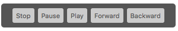
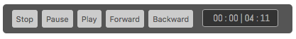
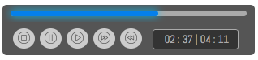
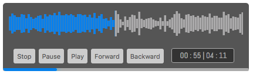
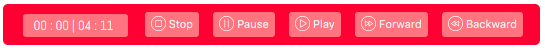

# Musique JS
Swiftly Parse Your Audio Player

Author: Maxwell Alexius

## Getting Started
Download and clone the repository, then include the files (assume you placed the files into assets folder) :

```html
<link rel="stylesheet" href="./assets/css/musique.css">
<script src="./assets/js/musique.js"></script>
```

## Topics
General feature and usage all about MusiqueJS :

#### Basics
- [Brief View of MusiqueJS](#ch1-01)
- [MusiqueJS Options](#ch2-01)

#### Features
- [Control Buttons](#ch3-01)
- [Timer](#ch4-01)
- [Progress Bar](#ch5-01)
- [Waveform](#ch6-01)

#### References
- [Options](#ch7-01)
- [Methods](#ch8-01)
- [Events](#ch9-01)
- [Style](#ch10-01)

<div id="ch1-01"></div>
## Brief View of MusiqueJS

MusiqueJS helps you parse audio player in a simple way, it can be customized easily and also it has many features and styles to let you explore.

To parse out plain HTML5 audio API, it is simple as below, specify your render element's ID and the source URL of the audio :

```html
<div id="audio-player"></div>

<script>
  var musique = new Musique({
    render: 'audio-player',
    sourceURL: AUDIO_SOURCE_URL
  });
</script>
```

<div style="text-align: center;"></div>

You can also render 'player' type, it will have buttons that controls the player :

```html
<div id="audio-player"></div>

<script>
  var musique = new Musique({
    render: 'audio-player',
    sourceURL: AUDIO_SOURCE_URL,
    type: 'player'
  });
</script>
```

<div style="text-align: center"></div>

You can assign timer into your player :

```html
<div id="audio-player"></div>

<script>
  var musique = new Musique({
    render: 'audio-player',
    sourceURL: AUDIO_SOURCE_URL,
    type: 'player',
    showTimer: true
  });
</script>
```

<div style="text-align: center"></div>

Or perhaps add progress bar into your audio player :

```html
<div id="audio-player"></div>

<script>
  var musique = new Musique({
    render: 'audio-player',
    sourceURL: AUDIO_SOURCE_URL,
    type: 'player',
    showTimer: true,
    showProgressBar: true,
    roundedButton: true,
    style: {
      progressBarHeight: 7,
      progressBarSpacing: 10,
      progressBarPadding: 7
    }
  });
</script>
```

<div style="text-align: center"></div>

Another awesome feature is to add waveform into your audio player, it is credited by [WaveSurfer.js API](https://wavesurfer-js.org). You need to include the [WaveSurfer CDN](https://cdnjs.com/libraries/wavesurfer.js), and then you can use the `showWaveform` feature :

```html
<div id="audio-player"></div>

<script>
  var musique = new Musique({
    render: 'audio-player',
    renderSequence: ['waveform', 'control', 'progressBar'],
    sourceURL: AUDIO_SOURCE_URL,
    type: 'player',
    showTimer: true,
    showProgressBar: true,
    autoPlay: false,
    showWaveform: true
  });
</script>
```

<div style="text-align: center"></div>


So far it does not contains only these small tricks, it can also customize the style by adding style option with an object type of value. For example :

```html
<script>
  var musique = new Musique({
    render: 'example',
    sourceURL: AUDIO_SOURCE_URL,
    type: 'player',
    style: {
      bgc: '#0a6298',
      borderRadius: 40,
      btnRadius: 15,
      btnTextColor: '#b5cfe0',
      btnBgc: '#5391b6',
      btnHoverTextColor: '#eee',
      btnHoverBgc: '#84b0cb',
    }
  });
</script>
```

<div style="text-align: center"></div>

For another example :

```html
<script>
  var musique = new Musique({
    render: 'example',
    sourceURL: AUDIO_SOURCE_URL,
    type: 'player',
    showtimer: true,
    timerPosition: 'left',
    showButtonIcon: true,
    buttonIconType: 'white',
    style: {
      bgc: '#fb5c5c',
      btnSpacing: 7,
      btnTextColor: '#eee',
      btnBgc: '#fc8585',
      btnHoverTextColor: '#eee',
      btnHoverBgc: '#fdadad',
      timerSpacing: 10,
      timerColor: '#eee',
      timerBgc: '#fc8585',
      timerBorder: 'none'
    }
  });
</script>
```

<div style="text-align: center"></div>

For more information about customizing styles in MusiqueJS, please view [Style Reference](#ch7-01)

<div id="ch2-01"></div>
## MusiqueJS Basic Options

In order to parse the audio player by MusiqueJS, there is a general format of the audio player :

```html
<script>
  var musique = new Musique({
    option1: value1,
    option2: value2,

    // ... Musique Option and Value Pairs ...

    // Musique Events followed by function type value and has a default "event" parameter
    event1: function(event) {
      // ... Musique Event1 Control Flow ...
    },
    event2: function(event) {
      // ... Musique Event2 Control Flow ...
    },

    // To append styles, you need to add "style" option. Inside the style option, you can append style key value pairs
    style: {
      style1: value1,
      style2: value2,
      // ... Musique Styles ...
    }
  });
</script>
```

For more information about options, you can view basic options in this section or view full stack of available options [here](#ch7-01).

For available events, please view [here](#ch9-01).

For available styles key-value pairs, please view [here](#ch10-01).

#### Required Options

Basically, you need to have these options in order to let the audio player render successfully :

| Option | Value Type | Default Value | Description |
|:------:|:----------:|:-------------:| ----------- |
| `render`| `string` | `null` | The `id` of the element which the audio player will render to. For example |
| `sourceURL` | `string` | `null` | The source of the audio, only accept type `.mp3`, `.ogg` or `.wav` |
| `type` | `string` | `default` | The type of the audio player, basic HTML5 type is `default`, customize type is `player` |

#### Optional

(Currently there are some options are under construction, we only release stable options in the list.)

| Option | Value Type | Default Value | Description |
|:------:|:----------:|:-------------:| ----------- |
| `customClass` | `string` | `""` | Add custom class into the `Musique` element |
| `autoPlay` | `boolean` | `false` | When the audio player is ready (or the `ready` event is fired), it will start playing audio automatically |
| `renderSequence` | `array` | `["progressBar", "control", "waveform"]` | The rendering sequence of the audio player. |
| `skipLength` | `number` | `5` | The skip length of the audio, it triggers along the `forward` or `backward` event, or along the method `forwardAudio()` or `backwardAudio()`. |
| `showControlButtons` | `boolean` | `true` | Determine whether to show the control button panel or not. For more information, see [Control Buttons Feature](#ch3-01) |
| `showTimer` | `boolean` | `false` | Determine whether to show the timer or not. For more information, see [Timer Feature](#ch4-01) |
| `showProgressBar` | `boolean` | `false` | Determine whether to show the audio progress bar or not. For more information, see [Progress Bar Feature](#ch5-01) |
| `showWaveform` | `boolean` | `false` | Determine whether to show the waveform or not. For more information, see [Waveform Feature](#ch6-01) |

For all the options reference, please click [here](#ch7-01).


<div id="ch3-01"></div>
## Control Buttons

UNDER CONSTRUCTION

<div id="ch4-01"></div>
## Timer

UNDER CONSTRUCTION

<div id="ch5-01"></div>
## Progress Bar

UNDER CONSTRUCTION

<div id="ch6-01"></div>
## Waveform

UNDER CONSTRUCTION

<div id="ch7-01"></div>
## Options

UNDER CONSTRUCTION

<div id="ch8-01"></div>
## Methods

Built-in methods should be called by the `Musique` object, for example :

```html
<script>
  var musique = new Musique({
    render: 'audio-player',
    sourceURL: AUDIO_SOURCE_URL,
    type: 'player',
  });

  // Calling built-in Musique method
  musique.playAudio();
</script>
```

Here is the list of the available methods :

| Methods | Description |
|:-------:| ----------- |
| `playAudio()` | Play the audio |
| `pauseAudio()` | Pause the audio |
| `stopAudio()` | Stop the audio |
| `forwardAudio()` | Forward the audio for `skipLength` seconds. (Default `skipLength` is 5 seconds) |
| `backwardAudio()` | Backward the audio for `skipLength` seconds. (Default `skipLength` is 5 seconds) |
| `isPlaying()` | Detect if the audio is playing, returns a `Boolean` value |
| `getCurrentTime()` | Get the current play time of the audio in seconds, returns a `Number` value |
| `getDurationTime()` | Get the total time of the audio, returns a `Number` value |
| `getVolume()` | Get the level of the volume of the audio, returns a `Number` value in range [0..100], which represents the percentage |
| `skipAudioTo(sec)` | Skip the audio current time to the specified second. Should pass in a `Number` type value which represents the second of the audio |
| `setVolume(percentage)` | Set the volume of the audio. Should pass in a `Number` type value which represents the level of the volume in percentage. (That is, the range of the value is [0..100]) |

<div id="ch9-01"></div>
## Events

Here is the list of available events :

| Events | Description | 
|:------:| ----------- |
| `ready` | Event fired when audio is ready to play. |
| `play` | Event fired when the audio started to play |
| `pause` | Event fired when the audio being paused |
| `stop` | Event fired when the audio stopped |
| `forward` | Event fired when forward the audio |
| `backward` | Event fired when backward the audio |
| `playing` | Event fired while audio is playing |

You can use the sample code below to test the event :

```html
<script>
  var eventsTest = new Musique({
    render: 'test-audio-event',
    sourceURL: AUDIO_SOURCE_URL,
    type: 'player',
    roundedButton: true,
    showTimer: true,
    ready: function(event) {
      console.log('"Ready" event fired!');
    },
    play: function(event) {
      console.log('"Play" event fired!');
    },
    pause: function(event) {
      console.log('"Pause" event fired!');
    },
    stop: function(event) {
      console.log('"Stop" event fired!');
    },
    forward: function(event) {
      console.log('"Forward" event fired!');
    },
    backward: function(event) {
      console.log('"Backward" event fired!');
    },
    playing: function(event) {
      console.log('"Playing" event fired!');
    }
  });
</script>
```

You can use `event.preventDefault()` and then add control or do something, for example :

```html
<script>
  var eventsTest = new Musique({
    render: 'test-audio-event',
    sourceURL: AUDIO_SOURCE_URL,
    type: 'player',
    roundedButton: true,
    showTimer: true,
    play: function(event) {
      event.preventDefault();

      /* DO SOMETHING HERE */
      
      eventsTest.playAudio(); // Then play the audio
    }
  });
</script>
```

Or you can "transplant" the event to other whichever kind of buttons or switch, for example :

```html
<div id="audio-player"></div>

<button onClick="musique.playAudio()">Play Me</button>
<button onClick="musique.pauseAudio()">Pause Me</button>
<button onClick="musique.stopAudio()">Stop Me</button>

<script>
  var musique = new Musique({
    render: 'audio-player',
    sourceURL: AUDIO_SOURCE_URL,
    showControlButtons: false
  });
</script>
```

Some Q & A :

- What is the difference between the `play` event and `playing` event ?
-- Answer from [StackOverflow](http://stackoverflow.com/questions/14265332/html5-play-event-vs-playing-event-in-video-tag).


<div id="ch10-01"></div>
## Style

Here are available styles you can append

| Style Options | Format | Default Value | Description | 
|:-------------:|:------:|:-------------:|-------------|
| `width` | `number` | Depend on customization | Width of the music player in "pixels" |
| `height` | `number` | Depend on custimization | Height of the music player in "pixels" |
| `padding` | `number` | `8` | Padding of the music player in "pixels" |
| `bgc` | `string` | `#555` | Background color of the music player with hex color format such as `#abcdef` or via `rgb()` or `rgba()` color |
| `borderRadius` | `number` | `5` | The border radius of the music player in "pixels" |
| `btnSpacing` | `number` | `3` | The left and right margin between buttons in "pixels" |
| `btnRadius` | `number` | `3` or `50%` | Radius of the button in 'pixels'. if the roundedButton option is set to `true`, btnRadius will be automatically set to `50%` |
| `btnTextColor` | `string` | `#555` | Text color of the button with hex color format such as `#abcdef` or via `rgb()` or `rgba()` color |
| `btnBgc` | `string` | `#ccc` | Background color of the button with hex color format such as `#abcdef` or via `rgb()` or `rgba()` color |
| `btnHoverTextColor` | `string` | `#777` | Text color of the button when hovering with hex color format such as `#abcdef` or via `rgb()` or `rgba()` color |
| `btnHoverBgc` | `string` | `#fff` | Background color of the button when hovering with hex color format such as `#abcdef` or via `rgb()` or `rgba()` color |
| `btnTransitionSec` | `number` | `0` | Transition time of the background color and text color of the button when hovered |
| `timerSpacing` | `number` | `10` | The left and right margin of the timer in "pixels" |
| `timerRadius` | `number` | `3` | The border radius of the timer in "pixels" |
| `timerColor` | `string` | `#aaa` | Text color of the timer with hex color format such as `#abcdef` or via `rgb()` or `rgba()` color |
| `timerBgc` | `string` | `#333` | Background color of the timer with hex color format such as `#abcdef` or via `rgb()` or `rgba()` color |
| `timerBorder` | `string` | `1px solid #aaa` | The border of the timer |